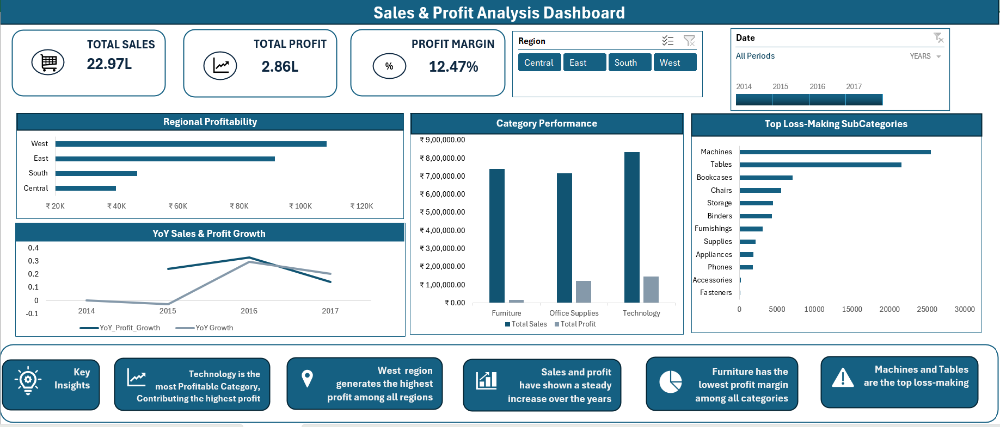
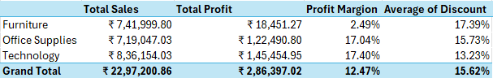

# Sales & Profit Analysis Dashboard

## Project Overview

The objective of this project was to analyze sales performance, profitability trends, regional performance, and loss-making products using the Superstore dataset.

The analysis was performed using Microsoft Excel, Power Pivot, DAX, Pivot Tables, Pivot Charts, and Interactive Dashboards to identify key business insights and provide actionable recommendations.

## Tools Used

Microsoft Excel, Power Query, Power Pivot, DAX(Data Analysis Expressions), Pivot Tables, Pivot Charts, and Interactive Slicers.

## Business Questions

1. How are sales and profits performing over time?
2. Which categories contribute the highest sales and profit?
3. Which regions generate the highest profitability?
4. Which subcategories generate the highest losses?
5. How does profit margin vary across categories?
6. What business areas require improvement?

## Analysis Performed
Category Analysis
Regional Analysis
Customer & Product Analysis
Loss Analysis
Time Analysis

## Dashboard

## Insights & Finding: 

## Report 1 - Category Performance Analysis

