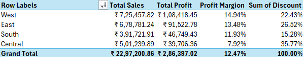
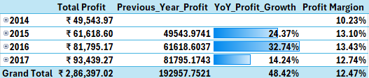

# Sales & Profit Analysis Dashboard

## Project Overview

The objective of this project was to analyze sales performance, profitability trends, regional performance, and loss-making products using the Superstore dataset.

The analysis was performed using Microsoft Excel, Power Pivot, DAX, Pivot Tables, Pivot Charts, and Interactive Dashboards to identify key business insights and provide actionable recommendations.

## Tools Used

Microsoft Excel, Power Query, Power Pivot, DAX(Data Analysis Expressions), Pivot Tables, Pivot Charts, and Interactive Slicers.

## Business Questions

1. How are sales and profits performing over time?
2. Which categories contribute the highest sales and profit?
3. Which regions generate the highest profitability?
4. Which subcategories generate the highest losses?
5. How does profit margin vary across categories?
6. What business areas require improvement?

## Analysis Performed
Category Analysis
Regional Analysis
Customer & Product Analysis
Loss Analysis
Time Analysis

## Dashboard

## Insights & Finding: 

## ✨ Report 1 - Category Performance Analysis

* The category performance analysis was conducted across three categories: Furniture, Office Supplies, and Technology.

#### ➤ Overall Performance

* The three categories collectively generated total sales of ₹22.97L and total profit of ₹2.86L, resulting in an overall profit margin of 12.47%.

* While the company has achieved strong sales performance, the gap between sales and profit indicates that profitability can be further improved through better cost and discount management.

#### ➤ Category-Wise Performance

* Technology emerged as the best-performing category, generating sales of ₹8.36L and profit of ₹1.45L, with the highest profit margin of 17.40%. The category demonstrates strong revenue generation and profitability.

* Office Supplies ranked second, generating sales of ₹7.19L and profit of ₹1.22L, with a profit margin of 17.04%. The category maintained consistent sales and profitability performance.

* Furniture generated sales of ₹7.42L but produced a profit of only ₹18.45K, resulting in a profit margin of just 2.49%. Despite strong sales volume, the category delivered significantly lower profitability compared to the other categories.

#### ➤ Key Insights

* Technology is the most profitable category and represents a major growth opportunity for the business. Expanding high-performing products within this category could further increase overall profitability.

* Office Supplies also demonstrates healthy profitability and contributes significantly to overall business performance.

* Furniture requires immediate attention. The category receives the highest average discount (17.39%) while generating the lowest profit margin (2.49%). A detailed review of pricing strategies, discount policies, and loss-making subcategories within Furniture is recommended to improve profitability.

## ✨ Report 2 - Regional Profitability Analysis

* The regional performance analysis was conducted across four regions: West, East, South, and Central.

#### ➤ Overall Performance

* The combined contribution of all regions resulted in total sales of ₹22.97L and total profit of ₹2.86L, producing an overall profit margin of 12.47%.

* Although the business remains profitable, there is a significant gap between sales and profit, indicating opportunities to improve operational efficiency and profitability.

#### ➤ Region-Wise Performance

* West emerged as the best-performing region, generating sales of approximately ₹7.25L and achieving a profit margin of 14.95%. The region contributes the highest share of overall profitability and demonstrates strong business performance.

* South delivered moderate performance with a healthy profit margin while maintaining relatively controlled discount levels compared to other regions.

* East performed reasonably well and remains a potential area for further growth and profitability improvement.

* Central was identified as the weakest-performing region, generating sales of approximately ₹5L while achieving a profit margin of only 7.92%.

* The Central region also recorded the highest discount contribution at 35.77%, significantly higher than other regions.

#### ➤ Key Insights

* West serves as the strongest region and can be used as a benchmark for best practices across other regions.

* East and South present opportunities for further profit growth through targeted sales and operational improvements.

* Central requires immediate attention. The combination of high discount levels and low profit margins suggests that excessive discounting may be negatively impacting profitability.

* A detailed review of discount policies, product mix, and pricing strategies within the Central region is recommended to improve overall business performance.

### ✨ Report 3 - Sales & Profit Growth Analysis

* Sales and profit trends were analyzed across four years, from 2014 to 2017.

#### ➤ Overall Performance

* The business demonstrated positive long-term growth in both sales and profit over the analysis period.

* Although sales experienced a slight decline in 2015, profitability continued to improve, indicating better profit generation despite lower revenue growth.

#### ➤ Year-over-Year Performance

* 2016 was the strongest year, recording the highest profit growth of 32.74% and the highest profit margin of 13.43%.

* 2017 continued to generate higher sales and profit compared to earlier years; however, profit growth slowed to 14.27%, indicating a moderation in growth momentum.

#### ➤ Quarterly Performance

* Q4 consistently emerged as the strongest-performing quarter across most years, contributing significantly to overall sales and profit.

* An exception was observed in Q4 2017, where profit margin declined to 9.80%, making it the weakest quarter of that year.

* Q1 2017 recorded the highest quarterly profit margin (19.09%) across the entire analysis period.

#### ➤ Key Insights

* The company has maintained a healthy growth trajectory in both sales and profitability.

* 2016 represents the peak year in terms of profitability and operational performance.

* The decline in Q4 2017 profit margin warrants further investigation, particularly regarding discounting, product mix, or operational costs during that period.

* Continued monitoring of quarterly profitability trends can help identify opportunities to sustain long-term business growth.

###

